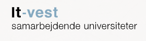

# AU BTECH AI Toolbox | Course-bot

  
   
  

---

## 🏛️ Project Governance
This project is officially funded by **IT-vest - samarbejdende universiteter**. 
---
Course-bot serves as the centralized AI infrastructure for **Aarhus University, Institute of Business Development and Technology (BTECH)**, providing specialized Course Bots for all Bachelor and Master programs.

## 🚀 The Mission
To empower students and faculty in Herning with state-of-the-art Generative AI tools, tailored specifically to the academic curriculum and course materials of BTECH.

## 🛠️ Tech Stack & Architecture
* **Interface:** Streamlit (Python-based)
* **LLM:** Mistral AI (Mistral-Medium-Latest)
* **Vector Database:** Weaviate Cloud (Hybrid Search enabled)
* **Environment Management:** TBD
* **Deployment:** TBD

## 📂 Repository Structure
* `/pages`: Modular Streamlit pages including the Teacher Dashboard and Prompt Library.
* `/img`: Official branding and UI assets.
* `student_portal.py`: The page, where students can ask all course bot questions
* `app.py`: The Mission Control (Main Entry Point).

---
*Developed for Aarhus University, BTECH. Supported by IT-vest.*

